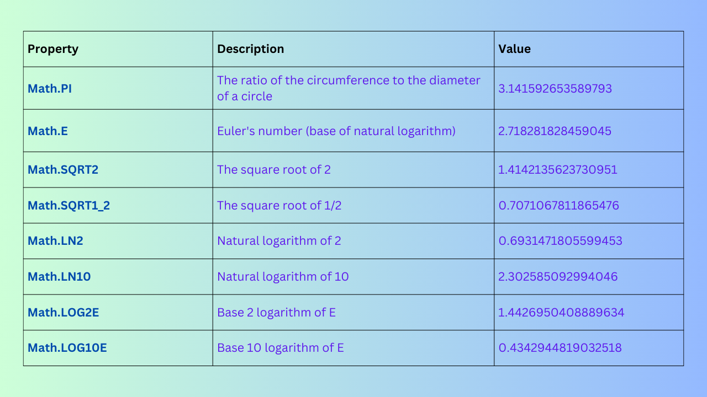
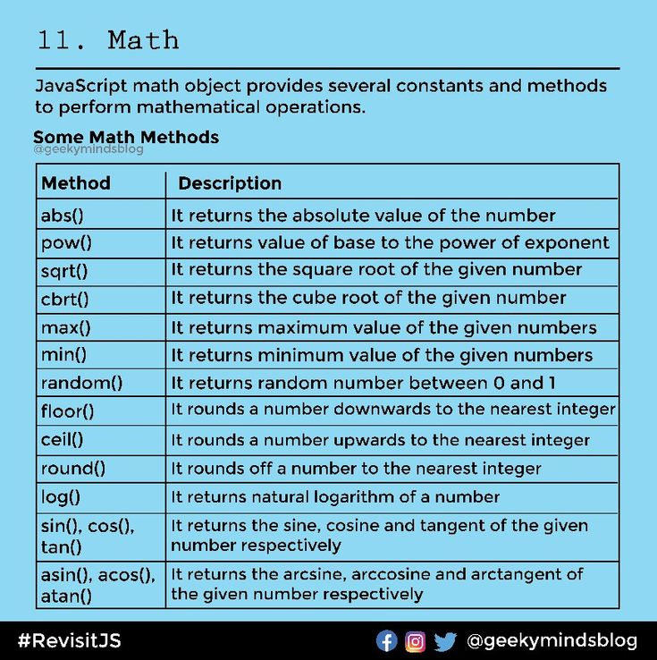

# Embending JavaScript in Html
Different ways of using JavaScript in your webpage.

- Inline JavaScript
- Internal JavaScript
- External Javascript

### Internal JavaScript
When js is written within the head section using element then it is called as internal js.Internal js can be also written within body tag.

```
<!DOCTYPE html>
<html>
<head>
    <title>Internal JS Example</title>
    <script>
        function greet() {
            alert("Hello from internal JavaScript!");
        }
    </script>
</head>
<body>
    <button onclick="greet()">Click Me</button>
</body>
</html>
```

### External JavaScript
Save JavaScript in a separate .js file and link it with
```
 <script src="..."></script>.

script.js
 function greet() {
    alert("Hello from external JS file!");
}
```

## Types of JavaScript Comments
- **Single-Line Comment (//):**
Used for short notes or disabling one line of code.
```
// This is a single-line comment
let x = 5; // This is an inline comment after code

```

-  **Multi-Line Comment (/* ... */):**
Used for longer explanations or temporarily removing multiple lines of code.
```
/* This is a 
   multi-line comment 
   in JavaScript */
let y = 10;
```

## Identifiers in JavaScript
In JavaScript, an identifier is the name you give to variables, functions, classes, or other entities in your code.

### Rules for Identifiers in JavaScript
- Can Contain:
  - Letters (A–Z, a–z)
  - Digits (0–9)
  - Underscore (_)
  - Dollar sign ($)
- Must not start with digit
- Case sensitive
- Cannot contain reserved keyword
- Can use Unicode characters (even emojis, though not recommended for serious code)
```
let π = 3.14;   // Valid
let 🚗 = "car"; // Valid
```

## Basic display function in JavaScript
1. **alert()** – Shows a popup message to the user
```
alert("Hello, this is an alert box!");
```
  - ✅ Good for quick notifications
  - ❌ Blocks interaction until the user clicks "OK"


2. **console.log()** – Displays messages in the browser’s console
```
console.log("This is a console log message.");
```
- ✅ Useful for debugging
- ❌ Not visible to normal users (only developers see it)

3. document.write() – Writes directly into the HTML page
```
document.write("Hello from document.write!");
```
- ✅ Simple for quick demos
- ❌ Not recommended for modern websites (can overwrite the whole page if called after it loads)

4. **confirm()** – Displays a message with OK/Cancel options
```
let result = confirm("Do you want to continue?");
console.log(result); // true if OK clicked, false if Cancel clicked
```

5. **prompt()** – Displays a dialog box asking for user input
```
let name = prompt("What is your name?");
console.log("Hello " + name);
```

## Keywords and Reserve words
In JavaScript, reserved keywords are special words that have a predefined meaning in the language’s syntax and cannot be used as identifiers (variable names, function names, etc.).


## JavaScript variable scope
There are two types of scope in javascript.They are:
- Global scope
- Local scope

### Global scope 
Variables declared outside of any function becomes global variables.It can be accessed and modified from any function.
```
<script>
var username="daenish";
        function modifyUserName()
        {
            username="Dinesh";
        }

        function showUserName()
        {
            alert(username);
        }
        alert(username);//display daenish
        modifyUserName();
        showUserName();//display Dinesh
</script>
```

### Local scope
Variables declared inside any function with var keyword are called local variables.It cannot be accessed or modified outside the function declaration.Function parameters are considered as local variables.
```
<script>
         function createUserName()
        {
            var username="Ramesh";
        }
        function showUserName()
        {
            alert(username);
        }
        createUserName();
        showUserName();//throws error: username is not defined
</script>
```

---

### **What is a Statement in JavaScript?**

In JavaScript, a **statement** is an instruction that tells the browser to perform a specific action.
It is the smallest executable unit of code.

For example:

```javascript
let x = 10;   // This is a statement (declaration + assignment)
console.log(x); // Another statement (function call)
```

So, a program is basically a sequence of **statements**.

---

### **Different Types of Statements in JavaScript**

JavaScript provides many types of statements. The major categories are:

---

#### 1. **Declaration Statements**

Used to declare variables, constants, or functions.

* `var`, `let`, `const`
* `function`

```javascript
let name = "Daenish";  
const PI = 3.14159;
```

---

#### 2. **Expression Statements**

Expressions followed by a semicolon that produce a value.

```javascript
x = 5 + 3;  
y++;  
```

---

#### 3. **Conditional Statements**

Used for decision-making.

* `if`
* `if...else`
* `if...else if...else`
* `switch`

```javascript
if (x > 10) {
   console.log("Greater than 10");
} else {
   console.log("10 or less");
}
```

---

#### 4. **Looping (Iteration) Statements**

Used to repeat actions.

* `for`
* `while`
* `do...while`
* `for...in` (iterate over object properties)
* `for...of` (iterate over iterable values like arrays)

```javascript
for (let i = 0; i < 3; i++) {
   console.log(i);
}
```

---

#### 5. **Jump Statements**

Used to alter the flow of execution.

* `break` (exit a loop/switch)
* `continue` (skip current loop iteration)
* `return` (exit from a function)

```javascript
for (let i = 1; i <= 5; i++) {
   if (i === 3) continue;
   console.log(i);
}
```

---

#### 6. **Try…Catch Statements (Exception Handling)**

Used to handle errors.

```javascript
try {
   let result = riskyFunction();
} catch (error) {
   console.log("Error occurred: " + error);
}
```

---

#### 7. **Empty Statement**

Just a semicolon `;` (does nothing, used sometimes in loops).

```javascript
for (let i = 0; i < 5; i++); // empty loop body
```

---

---
#### 8. **Object Manipulation Statement**
Js uses the for...in,for each...in,and with statement to manipulate objects.

---

## 🔹 1. `for...in` Statement

The **`for...in`** loop iterates over the **enumerable properties (keys)** of an object.

### Syntax:

```javascript
for (let key in object) {
   // code using key and object[key]
}
```

### Example:

```javascript
let person = { name: "Daenish", age: 20, country: "Nepal" };

for (let key in person) {
   console.log(key + " = " + person[key]);
}
```

✅ **Output:**

```
name = Daenish
age = 20
country = Nepal
```

👉 Use **`for...in`** when you want to **loop through keys of an object**.

---

## 🔹 2. `forEach` Statement

Strictly speaking, `forEach` is **not a statement**, it’s a **method** available on **arrays** (not directly on plain objects).
But we can use it with objects by combining it with **`Object.keys()`**, **`Object.values()`**, or **`Object.entries()`**.

### Syntax:

```javascript
Object.keys(object).forEach(function(key) {
   // code using key and object[key]
});
```

### Example:

```javascript
let person = { name: "Daenish", age: 20, country: "Nepal" };

Object.keys(person).forEach(function(key) {
   console.log(key + " = " + person[key]);
});
```

✅ **Output:**

```
name = Daenish
age = 20
country = Nepal
```

👉 Use **`forEach`** when you want to loop through **keys/values/entries** in a more **functional style** (often with arrow functions).

---


### ✅ Summary:

* Use **`for...in`** → directly loops through an object’s **keys**.
* Use **`forEach`** → usually for arrays, but with `Object.keys/values/entries()` it’s also useful for **object property iteration**.
---

Great 👍 Let’s go through **JavaScript Operators** in a structured way.

---

## 🔹 What is an Operator?

An **operator** is a special symbol that performs an operation on operands (values or variables).

Example:

```javascript
let x = 10 + 5;  // '+' is an operator, 10 and 5 are operands
```

---

## 🔹 Types of Operators in JavaScript

### 1. **Arithmetic Operators**

Used for mathematical calculations.

| Operator | Meaning             | Example        | Result |
| -------- | ------------------- | -------------- | ------ |
| `+`      | Addition            | `5 + 2`        | `7`    |
| `-`      | Subtraction         | `5 - 2`        | `3`    |
| `*`      | Multiplication      | `5 * 2`        | `10`   |
| `/`      | Division            | `5 / 2`        | `2.5`  |
| `%`      | Modulus (remainder) | `5 % 2`        | `1`    |
| `**`     | Exponentiation      | `2 ** 3`       | `8`    |
| `++`     | Increment           | `let x=5; x++` | `6`    |
| `--`     | Decrement           | `let x=5; x--` | `4`    |

---

### 2. **Assignment Operators**

Used to assign values.

| Operator | Example   | Equivalent to  |
| -------- | --------- | -------------- |
| `=`      | `x = 10`  | Assign 10 to x |
| `+=`     | `x += 5`  | `x = x + 5`    |
| `-=`     | `x -= 5`  | `x = x - 5`    |
| `*=`     | `x *= 5`  | `x = x * 5`    |
| `/=`     | `x /= 5`  | `x = x / 5`    |
| `%=`     | `x %= 5`  | `x = x % 5`    |
| `**=`    | `x **= 2` | `x = x ** 2`   |

---

### 3. **Comparison (Relational) Operators**

Used to compare two values.

| Operator | Meaning                         | Example     | Result  |
| -------- | ------------------------------- | ----------- | ------- |
| `==`     | Equal (value only)              | `5 == "5"`  | `true`  |
| `===`    | Strict equal (value + type)     | `5 === "5"` | `false` |
| `!=`     | Not equal (value only)          | `5 != "5"`  | `false` |
| `!==`    | Strict not equal (value + type) | `5 !== "5"` | `true`  |
| `>`      | Greater than                    | `5 > 2`     | `true`  |
| `<`      | Less than                       | `5 < 2`     | `false` |
| `>=`     | Greater than or equal           | `5 >= 5`    | `true`  |
| `<=`     | Less than or equal              | `5 <= 3`    | `false` |

---

### 4. **Logical Operators**

Used for logical conditions.

| Operator    | Example             | Result  |           |        |
| ----------- | ------------------- | ------- | --------- | ------ |
| `&&` (AND)  | `(5 > 2 && 10 > 5)` | `true`  |           |        |
| `\|\|` (OR) | \`(5 > 2            |         | 10 < 5)\` | `true` |
| `!` (NOT)   | `!(5 > 2)`          | `false` |           |        |

---

### 5. **Bitwise Operators**

Work on bits (binary).

| Operator | Meaning              | Example (5=0101, 1=0001) | Result |
| -------- | -------------------- | ------------------------ | ------ |
| `&`      | AND                  | `5 & 1`                  | `1`    |
| `\|`     | OR                   | `5 \| 1`                 | `5`    |
| `^`      | XOR                  | `5 ^ 1`                  | `4`    |
| `~`      | NOT                  | `~5`                     | `-6`   |
| `<<`     | Left shift           | `5 << 1`                 | `10`   |
| `>>`     | Right shift          | `5 >> 1`                 | `2`    |
| `>>>`    | Unsigned right shift | `5 >>> 1`                | `2`    |

---

### 6. **Ternary (Conditional) Operator**

Shortcut for `if...else`.

```javascript
let age = 18;
let result = (age >= 18) ? "Adult" : "Minor";
console.log(result); // Adult
```

---

### 7. **Type Operators**

| Operator     | Purpose                  | Example                         |
| ------------ | ------------------------ | ------------------------------- |
| `typeof`     | Returns type of variable | `typeof "hello"` → `"string"`   |
| `instanceof` | Checks object type       | `arr instanceof Array` → `true` |

---

### 8. **String Operators**

* Concatenation: `+`

```javascript
let first = "Hello";
let second = "World";
console.log(first + " " + second); // Hello World
```

* Concatenation assignment: `+=`

```javascript
let str = "Hello";
str += " JS";
console.log(str); // Hello JS
```

---

### 9. **Comma Operator**

Allows multiple expressions to be evaluated in one statement (returns last value).

```javascript
let x = (2, 3, 5);
console.log(x); // 5
```

---

### 10. **Optional Chaining Operator (`?.`)**

Safely access deeply nested properties.

```javascript
let user = { profile: { name: "Daenish" } };
console.log(user.profile?.name); // Daenish
console.log(user.address?.city); // undefined (no error)
```

---

## Array and For Each Loop
---
### Array
An array is an ordered collection of data.Arrays are complex variables that allow us to store more than one value or group of values under a single variable name.Each elements of the array has a fixed position called an index and stores a value.

#### 1.) To create an empty array simply use empty square brackets.
```
var emptyArray=[];
```
#### 2.) To create an array of elements enclose them in square brackets:
```
var ages=[10,23,24,78];
var subjects=["DBMS","NM","OS","SL","SE"];
```
#### 3.) In one array you can enclose values of different types:
```
var mixedArray=[12,13,"Daenish","Niraj"];
```
#### 4.) An array can contain objects and other arrays:
```
var complexArray=[{name:"daenish",age:21},["kathmandu","Pokhara"]];
```

**Another way of creating arrays is to use the Array constructor**

#### Create an empty array:
```
var emptyArray=new Array();
```
#### 1.) To create an array of elements pass more than one numeric value or non-numeric value as constructor arguments:
```
var arrayOne=new Array('n');//single element array
var arrayTwo=new Array(2,42,44);//array of numbers
var arrayThree=new Array(89,12.23,true,"apple");
```
#### 2.) If you pass a single numeric value as an argument,it is treated as an array length specification.
```
var newArray=new Array(5);
This creates an empty array with the specified 

var new Array=new Array(9.3);//RangeError: invalid array length
```
---

## Multi-dimensional array
```
var gamesWithPlayers=[
    ['Football',7],
    ['Cricket',18],
    ['Hockey',8],
]
console.log(gamesWithPlayers.join("\n"));
gamesWithPlayers.push(['Tennis',11]);
console.log(gamesWithPlayers.join("\n"));
gamesWithPlayers.pop();
console.log(gamesWithPlayers.join('\n'));//removes top element
```

## The Argument Object

All the functions in js can use arguments objects by default. An arguments objects includes values of each parameter.The arguments objects is an array like object. You can access its values using index similar to array. However,it does not support array methods.An arguments objects is valid even if function does not include any parameters.

---
```
function welcomeMessage(firstname,lastname)
{
    console.log("hello "+arguments[0]+" "+arguments[1]);
}
welcomeMessage("Daenish","arghali");
welcomeMessage(12,13)
```


we can remove two parameters and use arguments objects
```
function showMessage()
{
    console.log("Hello "+arguments[0]+" "+arguments[1]);
}
showMessage("Ram","Thapa");
```

An arguments objects can be iterated using for loop
```
function ShowMessage()
{
 for(var i=0;i<arguments.length;i++)
 {
    console.log(arguments[i]);
 }
}
ShowMessage("I","am","Daenish");
```
---

## Java Script Math Objects
Js math object is a top level,a predefiend obeject for mathematical constants and functions.Mathematical properties and functions can be calculated by math.property or math.method.





## Java-Script RegExp Object


### Interacting with the browser
Browser object is further divided into 5 sections:
- Window object
- Navigation object
- History object
- Screen object
- Location object

---
#### Window object
It is used to open a window in a brower to display the web pages.All data and information about any browser is atteched to the window object as properties and the frames property in the window object returns all the frames in the current window.
---
