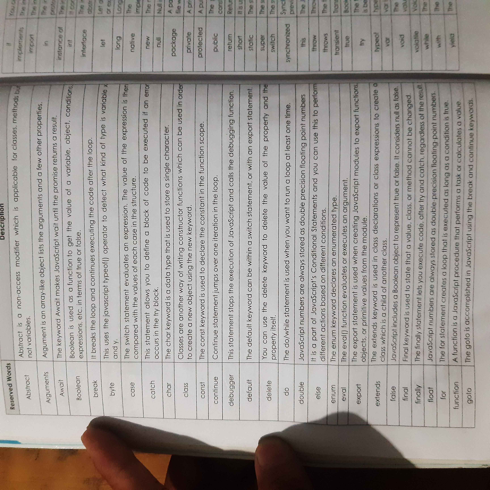

# Embending JavaScript in Html
Different ways of using JavaScript in your webpage.

- Inline JavaScript
- Internal JavaScript
- External Javascript

### Internal JavaScript
When js is written within the head section using element then it is called as internal js.Internal js can be also written within body tag.

```
<!DOCTYPE html>
<html>
<head>
    <title>Internal JS Example</title>
    <script>
        function greet() {
            alert("Hello from internal JavaScript!");
        }
    </script>
</head>
<body>
    <button onclick="greet()">Click Me</button>
</body>
</html>
```

### External JavaScript
Save JavaScript in a separate .js file and link it with
```
 <script src="..."></script>.

script.js
 function greet() {
    alert("Hello from external JS file!");
}
```

## Types of JavaScript Comments
- **Single-Line Comment (//):**
Used for short notes or disabling one line of code.
```
// This is a single-line comment
let x = 5; // This is an inline comment after code

```

-  **Multi-Line Comment (/* ... */):**
Used for longer explanations or temporarily removing multiple lines of code.
```
/* This is a 
   multi-line comment 
   in JavaScript */
let y = 10;
```

## Identifiers in JavaScript
In JavaScript, an identifier is the name you give to variables, functions, classes, or other entities in your code.

### Rules for Identifiers in JavaScript
- Can Contain:
  - Letters (A–Z, a–z)
  - Digits (0–9)
  - Underscore (_)
  - Dollar sign ($)
- Must not start with digit
- Case sensitive
- Cannot contain reserved keyword
- Can use Unicode characters (even emojis, though not recommended for serious code)
```
let π = 3.14;   // Valid
let 🚗 = "car"; // Valid
```

## Basic display function in JavaScript
1. **alert()** – Shows a popup message to the user
```
alert("Hello, this is an alert box!");
```
  - ✅ Good for quick notifications
  - ❌ Blocks interaction until the user clicks "OK"


2. **console.log()** – Displays messages in the browser’s console
```
console.log("This is a console log message.");
```
- ✅ Useful for debugging
- ❌ Not visible to normal users (only developers see it)

3. document.write() – Writes directly into the HTML page
```
document.write("Hello from document.write!");
```
- ✅ Simple for quick demos
- ❌ Not recommended for modern websites (can overwrite the whole page if called after it loads)

4. **confirm()** – Displays a message with OK/Cancel options
```
let result = confirm("Do you want to continue?");
console.log(result); // true if OK clicked, false if Cancel clicked
```

5. **prompt()** – Displays a dialog box asking for user input
```
let name = prompt("What is your name?");
console.log("Hello " + name);
```

## Keywords and Reserve words
In JavaScript, reserved keywords are special words that have a predefined meaning in the language’s syntax and cannot be used as identifiers (variable names, function names, etc.).



