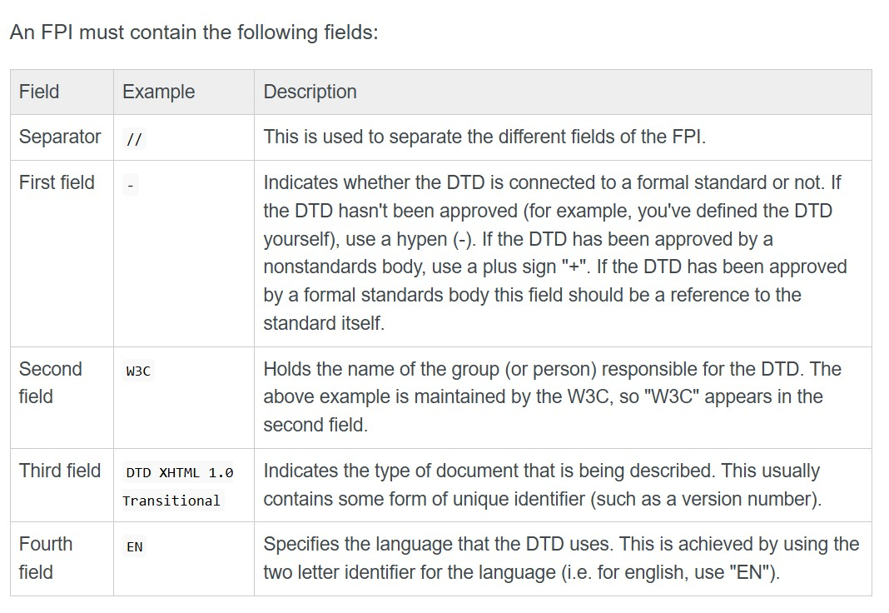

# DTD(Document Type Declaration)
Allows you to create rules for the elements within your XML documents.Although,XML itself has rules,the rule's defined in a DTD are specific to your needs.

# Do I need to create a DTD
If you have created your own XML elements,attributes,and entities ,then you should create your own DTD.If u are creating  an XML document using predifined elements,attributes,and entities(i.e one that has been created by someone else),then a DTD should already exist.All u need is to link to that DTD using the DOCTYPE declaration.

### Types of DTD 
- internal(written in the same document that it's being used in).
- external(located in the another document).

Syntax:
<!DOCTYPE root_name [DTD]>
**where root_name is the root element,and[DTD] is the actual defination.**
> Note : Whether you use internal or external DTD,the actual Syntax for DTD is same-The only differece between internal and external is the way
it it's declared with DOCTYPE


## Internal DTD
Using internal DTD,the code is placed between the DOCTYPE tags**(eg,<!  DOCTYPE tutorials [and]>).**

## External DTD
An externl DTD is the one that resides in a seperate file. To use the the external DTD,you need to  link from your XML document by providing the URI of the DTD file.
Here's  an example of an XML document that uses an external DTD.
```
<? xml version="1.0" standalone="no"?>
<! DOCTYPE tutorials SYSTEM "tutorials.dtd">
<tutorials type="web">
 <tutorial>
   <name>Xml tutorial</name>
   <url>https://www.quackit.com/xml/tutorial</url>
 </tutorial>

 <tutorial>
   <name>HTML tutorial</name>
   <url>https://www.quackit.com/html/tutorial</url>
 </tutorial>
</tutorials>

//here is an example if what tutorials.dtd(the external DTD file)could look like.Note:the external DTD file does not need the DOCTYPE declaration- it is already on the XML file that is using this DTD.
<! ELEMENT tutorials (tutorial)+>
<! ELEMENT tutorial(name,url)>
<! ELEMENT name(#PCDATA)>
<! ELEMENT url(#PCDATA)>
<! ATTLIST tutorials type CDATA #REQUIRED>
```

> NOTE: Standalone attribute is set to no.This is beacause the document relies on an external source(The DTD)


## COMBINED DTD
Using internal and external DTD at the same time.Here is the simple eg:
```
<? xml version="1.0" standalone="no"?>
<! DOCTYPE tutorials SYSTEM "tutorials.dtd" [
<! ELEMENT tutorial(summary)>
<! ELEMENT summary (#PCDTA)>
]>

<tutorials>
  <tutorial>
   <name>Xml tutorial</name>
   <url>https://www.quackit.com/xml/tutorial</url>
   <summary>Best XML tutorial on the web!</summary>
  </tutorial>

   <tutorial>
     <name>HTML tutorial</name>
     <url>https://www.quackit.com/html/tutorial</url>
     <summary>Best HTML tutorial on the web!</summary>
   </tutorial>
</tutorials>
```

# DTD FORMAL PUBLIC IDENTIFIER(FPI)
When declaring a DTD availabe for public use,you need to use the PUBLIC keyword within your DOCTYPE declaration.
### FPI SYNTAX:
field1//field2//field3//field4
### FPI EXAMPLE:
Here's real life example of an FPI .In this case,the DTD was created by the W3C for XHTML:
-//W3C//DTD XHTML 1.0 Transional/EN
## FPI FIELDS


# DTD ELEMENTS
## Basic Syntax:
The <! ELEMENT> declaration has the following syntax:
**<! ELEMENT element_name content_model>**

Here,element_name is the name of the element you're defining.The content_model could indicate a **specific rule,data or another element**.
- If it is a rule,it will be set to either ANY or EMPTY.
- If specifies data or another element,the data type/element name needs to be surrounded by brackets(i.e (tutorial) or (#PCDATA)).

### Plain text
PCDATA stands for Parsed Character Data and is the way you specify non-markup text in your DTDs.

### Unrestricted Elements
If it doesnot matter what your element contains,you can create an element using the content_model of ANY.
SYNTAX:**<! ELEMENT element_name ANY>**
> NOTE: this removes all syntax checking,so you should avoid this if possible.

### Empty Elements
Here's how you define an empty element:
```
<! ELEMENT element_name EMPTY>
<! ELEMENT header EMPTY>
```

### Child elements
Here is how you do that:
```
<! ELEMENT element_name(child_element_name)>
<! ELEMENT turorials(tutorial)>
<tutorials>
  <tutorial></tutorial>
</tutorials>
```

### Multiple child elements(Sequences)
```
<! ELEMENT element_name(child_element_namr,child_element_name,...,...)>
<! ELEMENT tutorial(name,url)>
<tutorials>
  <tutorial>
     <name></name>
     <url></url>
  </tutorial>
</tutorials>
```

## DTD ELEMENT OPERATORS
### Zero or more
Use an asterisk(*).
```
<! ELEMENT element_name(child_element_name*)>
<! ELEMENT tutorials(tutorial*)>
```
### One or more
Use a plus sign(+).
```
<! ELEMENT element_name(child_element_name+)>
<! ELEMENT tutorials(tutorial+)>
```

### Zero or one
Use a question mark(?).
```
<! ELEMENT element_name(child_element_name?)>
<! ELEMENT tutorials(tutorial?)>
```

### Choices
Use pipe(|) operator.For eg, if a tutorial element requires a child called either name,title,or subject(but only one of these).
```
<! ELEMENT element_name(choice1 | choice2 | choice3)>
<! ELEMENT tutorial(name | title | subject)>
```

### Mixed content
Use pipe(|) operator to specify that element can contain both PCDATA and other elements:
```
<! ELEMENT element_name(#PCDATA | child_element_name)>
<! ELEMENT tutorial (#PCDATA | title | subject)>
```

# DTD ATTRIBUTES
SYNTAX:
```
<! ATTLIST element_name
attribute_name TYPE DEFAULT_VALUE
attribute_name TYPE DEFAULT_VALUE
attribute_name TYPE DEFAULT_VALUE
>
```
## DTD ATTRIBUTE DEFAULT VALUES
### 1.) # REQUIRED
Specifies that you won't be providing a defailt value,but that you require that anyone using this DTD does provide one.
```
<! ATTLIST element_name attribute_name CDATA #REQUIRED>
<! ATTLIST tutorial published CDATA #REQUIRED>  
```

### 2.)IMPLIED
Specifies that you won't be providing a default value,and that the attribute is optional for users of this DTD.
```
<! ATTLIST element_name attribute_name CDATA #IMPLIED>
<! ATTLIST tutorial rating CDATA #IMPLIED>
```

### 3.) FIXED
Specifies that you will provide value,and that's the only value that can be used by users of this DTD.
```
<! ATTLIST element_name attribute_name CDATA #FIXED "value">
<! ATTLIST tutorial language CDATA #FIXED "EN">
```

# DTD ATTRIBUTE TYPES
## CDATA
```
Syntax:
<! ATTLIST element_name attribute name CDATA default_value>
eg:
<! ATTLIST mountain country CDATA "New Zealand">
<mountains>
  <mountain country="New Zealand">
    <name>Mount Cook</name>
  </mountain>
  <mountain country="Australia">
    <name>Cradle Mountain</name>
  </mountain>
</mountains>
```

## Enumerated
This enables the DTD users to provide value from the list of possible values.
```
Syntax:
<! ATTLIST element_name attribute_name (value1 | value2 | value3) default_value>
eg:
<! ATTLIST tutorial published (yes | no) "no">
XML:
<tutorials>
  <tutorial published="yes">
    <name>XML tutorial</name>
  </tutorial>

  <tutorial published="no">
    <name>HTML tutorial</name>
  </tutorial>

  <tutorial>
    <name>Css tutorial</name>
  </tutorial>
</tutorials>
```

## ENTITY 
The attribute type of ENTITY is used for refering to the name of an entity you've declared in your DTD.
```
Syntax:
<! ATTLIST  element_name attribute_name ENTITY default_value>

eg:DTD
<! ATTLIST mountain photo ENTITY #IMPLIED>
<! ENTITY mt_cook_1 SYSTEM "mt_cook1.jpg">

eg:XML
<mountains>
  <mountain photo="mt_cook_1">
    <name>Mount Cook</name>
  </mountain>

  <mountain>
    <name>Cradle Mountain</name>
  </mountain>
</mountains>
```

## ENTITIES
The attibute type ENTITIES allows you to refer to multiple entity names,seperated by a space.
```
Syntax:
<! ATTLIST element_name attribute_name ENTITIES default_value>

eg:DTD
<! ATTLIST mountain photo ENTITIES #IMPLIED>
<! ENTITY mt_cook_1 SYSTEM "mt_cook1.jpg">
<! ENTITY mt_cook_2 SYSTEM "mt_cook2.jpg">

eg:XML
<mountains>
  <mountain photo ="mt_cook_1 mt_cook_2">
    <name>Mount Cook</name>
  </mountain>

  <mountain>
    <name>Cradle Mountain</name>
  </mountain>
  </>
</mountains>
```

## ID
The attribute type of ID  is used specially to identify elements.
> Note: Because of this,no two elements can contain the same value for attributes of type ID.Also you can only give an element one attribute of type ID.The value that is assigned to an attribute of type ID must be a valid XML name.

```
Syntax:
<! ATTLIST element_name attribute_name ID default_value>

eg:DTD
<! ATTLIST mountain mountain_id ID #REQUIRED>

eg:XML
<mountains>
  <mountain mountain_id="m10001">
    <name>Mount Cook</name>
  </mountain>

  <mountain mountain_id="m10002">
    <name>Cradle Mountain</name>
  </mountain>
</mountains>
```

## IDREF
The attribute type of IDREF is used for referring to an ID value of another element in the document.
```
Syntax:
<! ATTLIST element_name attribute_name IDREF default_value>

eg:DTD
<! ATTLIST employee employee_id ID #REQUIRED manager_id IDREF #IMPLIED>

eg:XML
<employees>
  <employee employee_id="e10001" manager_id="e1002">
    <first_name>Daenish</first_name>
    <last_name>Arghali</last_name>
  </employee>

  <employee employee_id="e1002">
    <first_name>jaan</first_name>
    <last_name>kumari</last_name>
  </employee>
</employess>
```

## IDREFS
The attribute type of IDREFS is used for referring to the ID  values of more than one other element in the document.Each value is seperated by a space.

```
Syntax:
<! ATTLIST element_name attribute_name IDREFS default_value>

eg:DTD
<! ATTLIST individual individual_id ID #REQUIRED parent_id IDREFS #IMPLIED>

eg:XML
<individuals >
 <individual individual_id="e10001" parent_id="e10002 e10003">
   <first_name></first_name>
   <last_name></last_name>
 </individual>

 <individual individual_id="e10002" >
   <first_name></first_name>
   <last_name></last_name>
 </individual>

 <individual individual_id="e10003">
   <first_name></first_name>
   <last_name></last_name>
 </individual>
</individuals>
```

## NMTOKEN
An NMTOKEN(name token) is any mixture of Name characters.It cannot contain whitespace(although leading or trailing whitespaces wil be trimmed/ignored).While names have restrictions on the initial character(the first character of Name cannot include digits,the full stop and the hypen),the NMTOKEN doesn't have these restrictions.
```
Syntax:
<! ATTLIST element_name attribute_name NMTOKEN default_value>

eg:DTD
<! ATTLIST mountain country NMTOKEN #REQUIRED>

eg:XML
<mountains>
  <mountain country="NZ">
    <name>Mount Cook</name>
  </mountain>

  <mountain country="AU">
    <name>Cradle Mountain</name>
  </mountain>
</mountains>
```

## NMTOKENS
The attribute type of NMTOKENS allows the attribute value to be made up of multiple NMTOKENSs,sperated by a space.
```
Syntax:
<! ATTLIST element_name attribute_name NMTOKENS default_value>

eg:DTD
<! ATTLIST mountains country NMTOKENS #REQUIRED>

eg:XML
<mountains country="NZ AU">
  <mountain>
    <name>Mount Cook</name>
  </mountain>

  <mountain>
    <name>Cradle Mountain</name>
  </mountain>
</mountains>
```

## NOTATION
The attibute type of NOTATION allows you to use a value that has been declared as a notation in the DTD.It is **used to specify the format of non-XML data**.A common use of notations is to describe MIME types such as image/gif,image/jpeg etc.
```
Syntax:
<! NOTATION name SYSTEM "external_id">
<! ATTLIST element_name attribute_name NOTATION default_value>

eg:DTD
<! NOTATION GIF SYATEM "image/gif">
<! NOTATION JPG SYATEM "image/jpg">
<! NOTATION PNG SYATEM "image/png">
<! ATTLIST mountain photo ENTITY #IMPLIED photo_type NOTATION (GIF | JPG | PNG) #IMPLIED>
<! ENTITY mt_cook_1 SYSTEM "mt_cook1.jpg">

eg:XML
<mountains>
  <mountain photo="mt_cook_1" photo_type="JPG">
    <name>Mount Cook</name>
  </mountain>

  <mountain>
    <name></name>
  </mountain>
</mountains>

```
