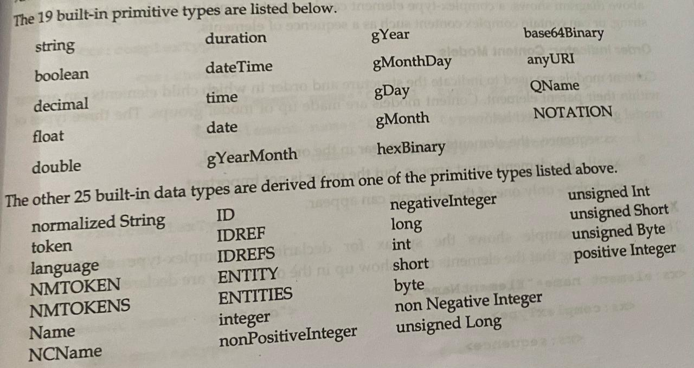

# XML schema
An XML Schema describes the structure of an XML document.XML document that attempts to adhere to an XML schema are said to be instance of that schema.If they are correctly adhere to the schema,then they are valid instances.A well formated XML document follows all the syntax rules of XML,but it doesnot necessarily adhere to any particular schema.So, **an XML document can be well formed without being valid,but cannot be valid unless it is well formed**.
> Note: An XML schema describes the structure of an XML instance document by defining what each element must or may content.

### Root element:schema with a namespace declaration
```
<xs:schema xmlns:xs="https://www.w3.org/2001/XMLSchema>
</xs:schema>
```
Possible namespace Prefixes:**xs,xsd,or none**.
The following are the high level overview of Schema types.
## Simple type
- Elements can be simple type or complex type.
- Simple type element can only contain text,child elements and attributes not allowed,all the build-in types(eg, xs:string).
- Schema author can derive simple types by restricting another simple type.for eg,an email type could be derived by limiting a string to a specific pattern,can be atomic(eg: string & integers) or non-atomic(eg: lists).




## Complex type
- By default complex-type element have complex content-they have child elements.
- They can limited to having no content(empty) or simple content,but they may have attributes.
- Mixed content-a combination of text and child element.

# XML Schema Element Declaration
Elements are declared using an element named xs:element with an attribute that gives the name of the element being defined.Element declaration cab be one of two sorts.
## Simple Type
A simple-type element is defined using the type attribute.

Example
```
<xs:element name="item" type="xs:string"/>
<xs:element name="price" type="xs:decimal"/>
```
> Note: XML Schema specifies 44 build-in types,19 of which are primitive.

```
Example
<?xml version="1.0"?>
<xs:schema xmlns:xs="https://www.w3.org/2001/XMLSchema">
  <xs:element name="Author">
     <xs:complexType>
        <xs:sequence>
           <xs:element name="FirstName" type="xs:string"/>
           <xs:element name="LastName" type="xs:string"/>
        </xs:sequence>
     </xs:complexType>
  </xs:element>
</xs:schema>

XML for above code:
<Author>
  <FirstName>Daenish</FirstName>
  <LastName>Arghali</LastName>
</Author>
```

## Order Indicator:Content Models
Content-Models are used to indicate the structure and the order in which child elements can appear within their parent elements.Three types of model groups are listed below:
- xs:sequence- the elements must appear in the order specified.
- xs:all- the elements must appear,but the order is not important.
- xs:choice- only one of the elements can appear.

Syntax:
```
<xs:element name="ElementName">
  <xs:complexType>
    <xs:sequence/all/choice>
      <xs:element name="Child1" type="xs:string"/>
      <xs:element name="Child2" type="xs:string"/>
      <xs:element name="Child3" type="xs:string"/>
    </xs:sequence/all/choice>
  </xs:complexType>
</xs:element>
```

## CREATE NAMED TYPES

# MIXED CONTENT
The situation where an element has both text and elements in its content.
```
<!-- XSD: -->
<xs:element name="narrative">
  <xs:complexType mixed="true">
    <xs:choice minOccurs="0" maxOccurs="unbounded">
       <xs:element name="bold" type="xs:string"/>
       <xs:element name="italic" type="xs:string"/>
       <xs:element name="underline" type="xs:string"/>
    </xs:choice>
  </xs:complexType>
</xs:element>

<!-- XML: -->
<narrative>
Higher beings from <italic>outer space</italic> may not want to tell us the <underline>secret of life</underline> beacause we're not ready
.But maybe they will change their tune after a little <bold>turture</bold><italic>Jack Handey</italic>
</narrative>
```

# ATTRIBUTE SPECIFICATION
Attributes are defined using the element xs:attribute with its own attributes,name and type.
- The xs:attribute element must lie inside a complex type specification,but the type of new attribute(its value) must be a simple type.
- Attribute values maynot contain elements or other attributes.

# ATTRIBUTES with empty elements
The only content inside the xs:complexType element will be the attribute definations.This complex type defination can be an anonymous type or a named type.
```
<xs:complexType>
  <xs:attribute name="src" type="xs:anyURL"/>
  <xs:attribute name="width" type="xs:integer"/>
  <xs:attribute name="height" type="xs:integer"/>
</xs:complexType>
```

# ATTRIBUTES for Elements with Only Text Content
We need a complex type to allow for attribute defination,but need a simple type specify the text content.The soln is to place an xs:simpleContent element inside of the complex type and use xs:extension element to specify the simple type.
```
<xs:element name="bookTitle">
  <xs:complexType>
     <xs:simpleContent>
      <xs:extension base="xs:string">
         <xs:attribute name="author" type="xs:string"/>
         <xs:attribute name="isbn" type="xs:string"/>
      </xs:extension>
     </xs:simpleContent>
  </xs:complexType>
</xs:element>
```

# Default and Fixed value for Attribute:
## Default Values
To specify a default value,use the default attribute of the xs:attribute element.Default values for attributes work slightly differently than they do for elements.If the attribute is not included in the instance document,the schema processor inserts it with the default value.
```
<xs:element name="FirstName">
  <xs:complexType>
    <xs:simpleContent>
      <xs:extension base="xs:string>
        <xs:attribute name="Full" type="boolean" default="true"/>
      </xs:extension>
    </xs:simpleContent>
  </xs:complexType>
</xs:element>
```

## Fixed Values
Attribute values can be fixex,meaning that,if they appears in the instance document,they must contain a specified value.Like with the simpe-type elements,this is done with the fixed attribute.
```
<xs:element name="Name">
  <xs:complexType>
     <xs:sequence>
       <xs:element name="FirstName">
         <xs:complexType>
            <xs:simpleContent>
               <xs:extension base="xs:string">
                  <xs:attribute name="Full" type="xs:boolean" default="true"/>
               </xs:extension>
            </xs:simpleContent>
         </xs:complexType>
       </xs:element>
       <xs:element name="LastName" type="xs:string"/>
     </xs:sequence>
     <xs:attribute name="Pseudonym" type="xs:boolean" fixed="true"/>
     <xs:attribute name="HomePage" type="xs:anyURL"/>
  </xs:complexType>
</xs:element>
```

# REQUIRED ATTRIBUTE
```
<xs:attribute name="HomePage" type="xs:anyURL" use="required"/>
```

# Restrictions on Contents(facets):
With XML Schemas,you can also add your own restrictions in your XML elements and attributes.These restrictions are called facets.

# XSD RESTRICTIONS/FACETS
## Restrictions on Values
The following examples defines an element called "age" with a restrictions.The value of age cannot be below than 0 or greater than 120.
```
<xs:element name="age">
  <xs:simpleType>
    <xs:restriction base="xs:integer">
       <xs:minInclusive value="0"/>
       <xs:maxInclusive value="120"/>
    </xs:restriction>
  </xs:simpleType>
</xs:element>
```

## Restrictions on Set of Values
- To limit the content of an XML element to a set of acceptable values,we should use the **enumeration** constraint.
- The eg: below defines an element called "car" with a restriction.The only accepted values are:Audi,Golf,BMW.
```
<xs:element name="car">
  <xs:simpleType>
    <xs:restriction base="xs:string">
      <xs:enumeration value="Audi"/>
      <xs:enumeration value="Golf"/>
      <xs:enumeration value="BMW"/>
    </xs:restriction>
  </xs:simpleType>
</xs:element>
```
or
```
<xs:element name="car" type="carType"/>
<xs:simpleType name="carType">
    <xs:restriction base="xs:string">
      <xs:enumeration value="Audi"/>
      <xs:enumeration value="Golf"/>
      <xs:enumeration value="BMW"/>
    </xs:restriction>
</xs:simpleType>
```

## Restrictions on Series of Values.
- To limit the content of an XML element to define a series of numbers or letters,use the **pattern** constraint.
- The eg: below defines an element called "letter" with a restriction.The only acceptable value is ONE of the LOWERCASE lettersss from a to z.
```
<xs:element name="letter">
  <xs:simpleType>
    <xs:restriction base="xs:string">
       <xs:pattern value="[a-z]"/>
    </xs:restriction>
  </xs:simpleType>
</xs:element>
```

The next eg defines an element called "initials" with a restriction.The only accepted value is THREE of the UPPERCASE letters from A to Z.
```
<xs:element name="initials">
  <xs:simpleType>
    <xs:restriction base="xs:string">
      <xs:pattern value="[A-Z][A-Z][A-Z]"/>
    </xs:restriction>
  </xs:simpleType>
</xs:element>
```

The next eg defines an element called "choice" with a restriction.The only acceptable value is ONE of the following letters:x,y Or z.
```
<xs:element name="choice">
  <xs:simpleType>
    <xs:restriction base="xs:string">
      <xs:pattern value="[xyz]"/>
    </xs:restriction>
  </xs:simpleType>
</xs:element>
```

The next eg defines an element called "zipcode" with a restriction.The only acceptable value is FIVE digits in a sequence,and each digit must be in range from 0 to 9.
```
<xs:element name="zipcode">
  <xs:simpleType>
    <xs:restriction base="xs:integer">
      <xs:pattern value="[0-9][0-9][0-9][0-9][0-9]"/>
    </xs:restriction>
  </xs:simpleType>
</xs:element>
```

## Restriction on Whitespace Characters
- Use the white space constraint.
- The white space constraint is set to "preserve",which means the XML processor **WILL NOT** remove any white space characters.
```
<xs:element name="address">
  <xs:simpleType>
    <xs:restriction base="xs:string">
      <xs:whiteSpace value="preserve"/>
    </xs:restriction>
  </xs:simpleType>
</xs:element>
```

The white space constraints is set to "replace",which means that XML processor WILL REPLACE all whitespace characters(line feeds,tabs,spaces,and carriage returns) with spaces:
```
<xs:element name="address">
  <xs:simpleType>
     <xs:restriction base="xs:string">
        <xs:whiteSpace value="replace"/>
     </xs:restriction>
  </xs:simpleType>
</xs:element>
```

The white space constraint is set to "collapse",which means that XML processor WILL REMOVE white space characters(line feeds,tabs,spaces and carriage returns) are replaced with spaces,leading and trailing spaces are removed, and multiple spaces are reduced to a single space.
```
<xs:element name="address">
 <xs:simpleType>
   <xs:restriction base="xs:string">
     <xs:whiteSpace value="collapse"/>
   </xs:restriction>
 <:xs:simpleType>
</xs:element>
```

## Restriction on Length
- Use the **length,maxLength and minLength** constraints to limit the length of a value in an element.
- This eg defines an element called "password" with a restriction.The value must be exactly 8 characters.
```
<xs:element name="password">
  <xs:simpleType>
    <xs:restriction base="xs:string">
      <xs:length value="8"/>
    </xs:restriction>
  </xs:simpleType>
</xs:element>
```

- In this eg,the value must be minimum 5 characters and maximum 8 characters.
```
<xs:element name="password">
  <xs:simpleType>
    <xs:restriction base="xs:string">
      <xs:minLength value="5"/>
      <xs:maxLength value="8"/>
    </xs:restriction>
  </xs:simpleType>
</xs:element>
```


