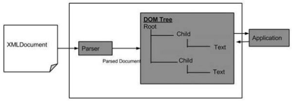

# XSL(EXTENSIBLE STYLE SHEET LANGUAGE)
- It is a powerful language for applying styles to XML documents.
- It has 2 parts:
 - **Formatting Language**: Allows you to apply style similar to what CSS does.Browser support for the XSL formatting language is limited at this stage.
 - **Transformation Language**: Also known as XSLT(XSL Transformations).Allows you to transform your XML document into another form.For eg: you can use XSLT to dynamically output some(or all) of the contents of your XML file into an HTML documents containing other contents.

# XSLT DOCUMENTS
An XSLT document is a valid document which consists of a number of elements/tags/attributes.These can be XSL elements or elements from another languages(such as HTML).When you look at an XSLT document,you will notice that it is constructed like any other XML documents.

A transformation can take place in one of the three locatios:
- On the server.
- On the client(for eg: your web page).
- With a standalone program.

# Need for XSL
In case of HTML documents,tags are predefined such as: table,div, and span; and the browser knows to how to add style on them and display those using CSS styles. But in case of XML documents, tags are not predefined. In order to understand and style an XML document,World Wide Consortium(W3C) devloped XSL which can act as XML based Style Sheet Language. An XSL document specifies how a browser should render an XML document.

Following are the main parts of XSL:
- **XSLT**:Used to transform XML document into various other types of documents.
- **XPATH**: Used to navigate XML document.
- **XSL-FO**: Used to format XML document.

## How does the XSLT WORKS?
- **XSLT processor** takes the XSLT style sheet and applies the transformation rules on the target XML document and then generates a formatted documents in the form of XML,HTML,or text format.
- This formatted document is then utilized by **XSLT formatter** to generate the actual output which is to be displayed to the end-user.

### XSLT template Element
```
<xsl:template>defines a way to reuse templates in order to generate the desired output for nodes of particular type/context.

<xsl:template
  name=Qname
  match=Pattern
  priority=number
  mode=Qname>
</xsl:template>

1.)name: Name of the element on which template is to be applied.
2.) match: Pattern which signifies the elements(s) on which template is to be applied.
3.)priority: Priority number of a template. Matching template with low priority is not considered in front of high priority template.
4.) mode: allows elements to be processed multiple times to produce a different result each time.
```

### XSLT value-of
```
<xsl:value-of> tag puts the value of the selected node as per XPath expression,as text.

<xsl:value-of
  select=Expression
  disable-output-escaping="yes" | "no" >
</xsl:value-of>

1.)select= XPath Expression to be evaluated in current context.
2.)disable-out-escaping: Default-"no". If "yes",output text will not escape xml characters from text.
```

### XSLT for-each
```
<xsl:for-each> tag applies a template repeatedly for each node.

<xsl:for-each
  select=Expression >
</xsl:for-each>

1.)select: XPath Expression to be evaluated in the current context to determine the set of nodees to be iterated.
```

### XSLT sort
```
<xsl:sort> tag specifies a sort criteria on the nodes.

<xsl:sort
  select= string-expression
  lang={nmtoken}
  data-type= {"text"| "number"| Qname}
  order={"ascending" | "descending"}
  case-order= {"upper-case" | "lower-case"}>
</xsl:sort>

1.) select: sorting key of the node.
2.) lang: language alphabet used to determine the sort of order.
3.) data-type: data type of the text.
4.) order: sorting order. Default is "ascending".
5.) case-order: sorting order of string by capitalization. Default is "upper-case".
```

### XSL IF Element
```
<xsl:if> tag specifies a conditional test against the content of nodes.

<xsl:if
  test=boolean-expression>
</xsl:if>
```

### XSL choose Element
```
<xsl:choose> tag specifies a multiple conditional tests against the content of nodes in conjuction with <xsl:otherwise> and <xsl:when> elements.

<xsl:choose>
  <xsl:when test="marks > 90" >
    High
  </xsl:when>

  <xsl:when test="marks > 80">
    Medium
  </xsl:when>

  <xsl:otherwise>
    Low
  </xsl:otherwise>
</xsl:choose>
```

# XQUERY
XQuery is a functional query language used to retrive information stored in XML format. It is same as for XML what SQL is for data base. It was designed to query XML data and build on Xpath expression.

## Use of XQuery
It is a functional language which is responsible for finding and extracting elements and attributes from an XML document. It can be  used for following things:
- To extract information to use in web service.
- To generate summary reports.
- To transform XML data to XHTML.
- Search web documents for relevant information.

## XQuery features
- Is a functional language used to retrive and query XML based data.
- Is Expression-oriented programming langauge with a simple type systems.
- Is analogous(similar) to SQL. for eg: As SQL is query language for databases, same as XQuery is query language for XML.
- Is XPath based ans uses XPath expressions to navigate through XML document.
- Is a W3C standard and universally supported by all major databases.

## XQuery advantages
- Can be used to retrieve both hierarchal and tabular data.
- Can be used to query tree and graphical structures.
- Can be used to build and query web pages.
- Best for XML based database and object-oriented based data bases. Object databases are more flexible and powerful than purely tabular databases.
- Used to transform XML documents into XHTML documents.

## XPath 
XPath is a language that describes a way to locate and process items in XML documents by using an address syntax based on a path through the document's logical structure or hierachy.
- Stands for XML Path Language.
- Uses "path like" syntax to identify and navigate nodes in an XML document.
- Contains over 200 build-in functions.
- Is a major element in the XSLT standard.
- Xpath is a W3C recommendation.

## SAX
- SAX(Simple API for XML) is an application program interface(API) that allows a programmer to interpret a Web file that uses (Extensible Markup Language)- that is, a Web file that describes the collection of data.
- It is an alternative to using the Document Object Model to interpret the XML file.
- As it's name suggests, it's a simpler interface than DOM and is appropriate where many or very large files are to be processed, but it contains fewer capabilities for manipulating the data content.
- SAX is a *event-driven* interface. The programmer specifies an event that may happen and, it does, SAX gets control and handles the situation. SAX works directly with an XML parser.

## DOM
- DOM is an application programming interface(API) for HTML and XML documents.
- Define logical structure of documents and the way a docuement is accessed and manipulated.
- The term "document" is used in the board sense-increasingly, XML is used as way of representing many different kinds of information that may be stored in diverse systems, and most of this would traditionally be seen as data rather then as documents.Nevertheless,XML presents this data as documents, and the DOM maybe used to manage this data.
- With the DOM, programmers can build documents, navigate their structure, and add, modify or delete elements or contents.
- Anything found in an HTML and XML documents can be accessed, changed, delete or add using DOM, with a few exceptions- in particular, the DOM interfaces for the XML internal and external subsets havenot yet been specified.
- As a W3C specification, one important objective for the Document Object model is to provide a standard programming interface that can be used in a wide variety of environments and applications. 
- The XMLDOM is a standard object model for XML. XML documents have a hierarchy of information units called **nodes**; DOM is a standard programming interface of describing those nodes and the relationship between them.
- As XML DOM also provides an API that allows a devloper to add, edit, move or remove nodes at any point on the tree in order to create an application.
- Following is the diagram for the DOM structure. The diagram depicts that parser evaluates an XML documents as a DOM structure by traversing through each node.



### Advantages of XML DOM
- Language and platfrom independent.
- **Traversable**: Information  in XML DOM is organized in a hirarchy which allows devloper to navigate around the hirarchy looking for specific information.
- **Modifiable**: It is dynamic in nature providing the devloper a scope to edit, add, move and remove nodes at any point on the tree.

### Disadvantages of XML DOM
1. It consumes more memory(if the XML structure is large) as program written once remains in memory all the time until and unless removed explicitly.
1. Due to the extensive use of memory, its operational speed, compared to SAX is slower.

# XML DOM- MODEL
A DOM document is a collection of *nodes* or pieces of information, organized in a hierarchy. Some types of nodes may have child nodes of various types and other are *leaf nodes* that cannot have anything under them in the document structure. Following is a list of the node types,with a list of node types that they may have as children-
1. **Document**: Element (maximum of one), Processing Instruction , Comment , Document type(maximum of one).
1. **Document Fragment**: Element, Processing Instruction, Comment, Text, CDATA Section, Entity Reference.
1. **Entity Reference**: Element, Processing Instruction, Comment, Text, CDATA Section, Entity Reference.
1. **Element**: Element, Processing Instruction, Comment, Text, CDATA Section, Entity Reference.
1. **Attr**: Text, Entity Refernce.
1. **Processing Instruction**: No children.
1. **Comment**: No Children.
1. **Text**: No children.
1. **CDATA Section**: No children.
1. **Entity**:Element, Processing Instruction, Comment, Text, CDATA Section, Entity Reference.
1. **Notation**: No children.

Eg: Consider the DOM representation of the following XML document **node.xml**
```
<?xml version="1.0" ?>
<Company>
 <employee category="technical">
   <FirstName>Tanmay</FirstName>
   <LastName>Patil</LastName>
   <ContactNo>1234567890</ContactNo>
 </employee>

 <employee category="non-technical">
   <FirstName>Taniya</FirstName>
   <LastName>Patil</LastName>
   <ContactNo>1234567890</ContactNo>
 </employee>
</Company>
```

The Document Object Model for the above XML document would be as follow-

From the above flowchar, we can infer-
- *Node* object can have only *one parent* node object. This occupies the position above all the nodes. Here it is company.
- The *parent node* can have multiple nodes called the *child nodes*. These child nodes can have additional nodes called the *attribute nodes*.In the above example, we have two atttibute nodes Technical and Non-Technical. The attribute node is not actually a child of the element node, but is still asscociated with it.
- These child nodes in turn can have multiple child nodes. The text within the nodes is called the *text node*.
- The node objects at the same level are called as siblings.
- The DOM identifies-
  - the object to represent the interface and manipulate the document.
  - the relationship among the objects and interfaces.

# Creating XML Parser
The XML DOM defines the properties and methods for accessing and editing XML. However, before an XML documents can be accessed, it must be loaded into an XML DOM object.
## Parsing a Text String
This example  parses a text string into an XML DOM object, and extracts the info from it with javascript.
